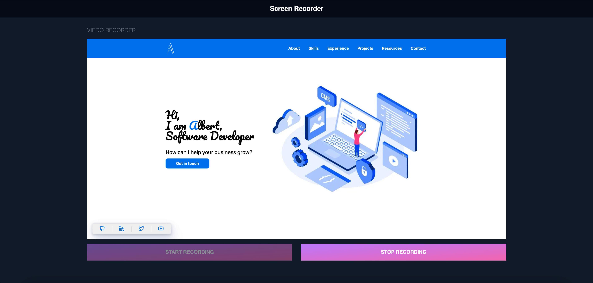
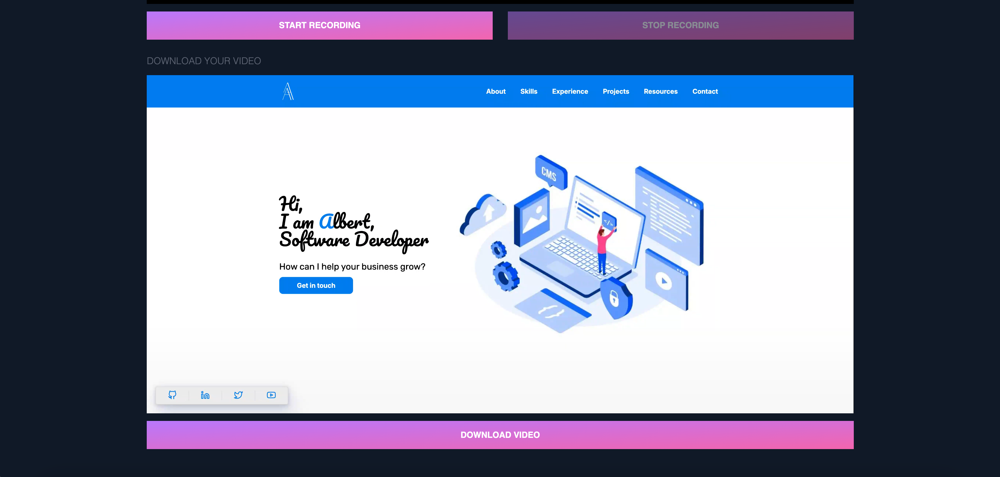

# Screen Recorder

<div align="center">
  
  
</div>

<div align="center">
  
  
  
</div>

<p align="center">
  A simple screen recorder written in Javascript for recording simple videos with the capability to <b>download</b> the recording.
</p>

## 📦 Running and Installing
1. Clone the repository
```bash
git clone https://github.com/AlbertArakelyan/screen-recorder-javascript
```

2. Install dependencies
```bash
npm install
```

3. Watch CSS, run following command to detect changes on Tailwind and compiling them into CSS in real time
```bash
npm run css
```

4. Run dev server for development
```
npm run dev
```

### Node versions
Make sure you have correct versions of **Nodejs** and **npm**
- node `v20.18.0`
- npm `v10.8.2`

## 📄 License
Licensed under the MIT License.

---

Feeling lucky? Give it a star ⭐ and fork for adding something from your side 😊.

Made with ❤️ by [Albert Arakelyan](https://github.com/AlbertArakelyan) <br>
https://www.albertarakelyan.com